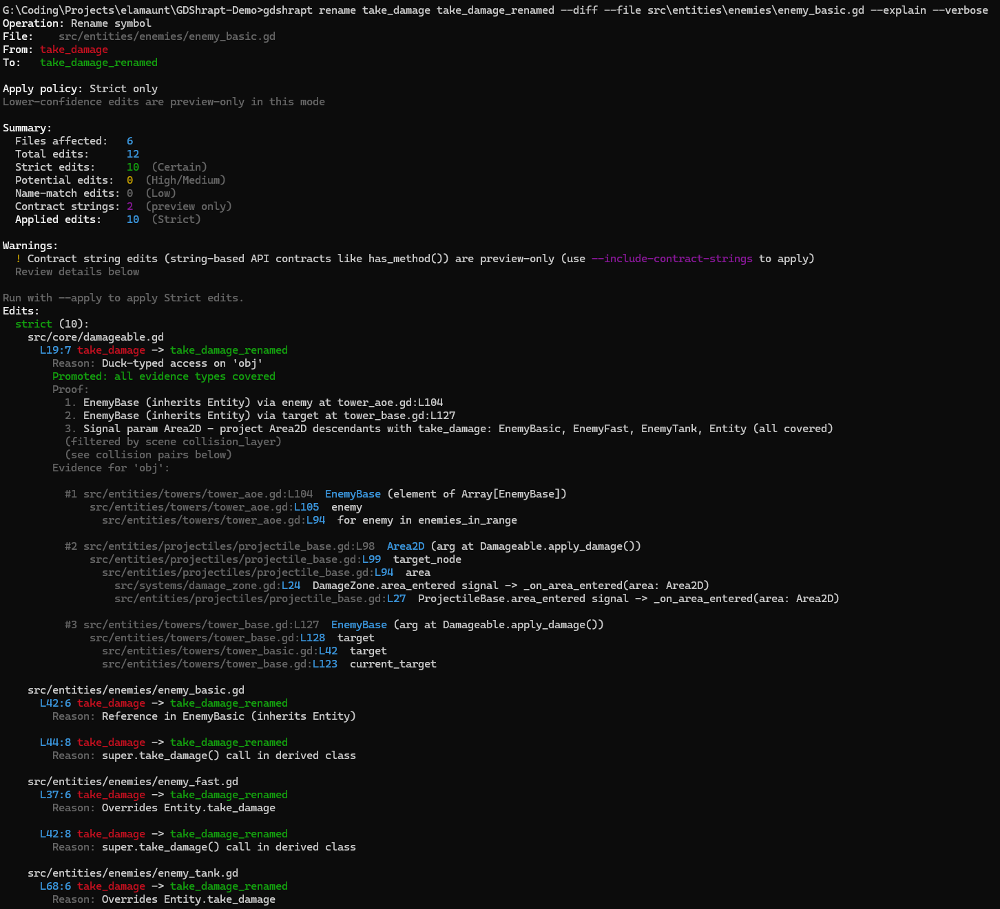

<!-- Logo -->
<p align="center">
  

<!-- The logo file is expected to be provided in the repository -->
</p>

# GDShrapt Tower Defence Demo

A demonstration Tower Defence game project for [GDShrapt](https://github.com/elamaunt/GDShrapt) — a semantic analysis and refactoring platform for GDScript.

This repository is intentionally designed to showcase **safe project‑wide rename with confidence levels** and other static analysis capabilities on a realistic Godot codebase.

---

## What this Demo Shows

This project is used to demonstrate:

- Project‑wide rename across:
  - Inheritance chains
  - `super` calls
  - Signal connections in `.tscn`
  - Duck‑typed call sites (`has_method`, dynamic dispatch)
- Confidence‑aware classification:
  - **Strict** (certain, safe to apply)
  - **Potential** (duck‑typed, preview only)
  - **Name‑match** (heuristic, preview only)
- Diff preview before apply
- Cross‑file semantic resolution
- Type inference across control flow

---

## Example CLI Output

```bash
gdshrapt rename take_damage take_damage_renamed -p ./GDShrapt-Demo --diff
```



### Confidence Model

| Level        | Meaning                                   | Applied in Base |
|--------------|-------------------------------------------|-----------------|
| **Strict**   | Proven semantic reference                 | ✅ Yes          |
| **Potential**| Duck‑typed / `has_method` / dynamic calls | ❌ Preview only |
| **Name‑match**| Name‑only heuristic                      | ❌ Preview only |

This prevents accidental breakage while still surfacing dynamic usages for manual review.

---

## Why This Matters (vs Godot Built‑in Tools)

Godot’s built‑in rename is **syntax‑based** and limited to local/static contexts.  
It cannot reliably handle:

- Inheritance overrides across multiple files
- `.tscn` signal method references
- Duck‑typed call sites
- Dynamic dispatch through `has_method`
- Confidence‑aware preview before applying changes

GDShrapt performs **semantic, project‑wide rename** with a safety model:

- Applies only **provably correct** edits by default
- Surfaces dynamic usages separately
- Shows a full diff before any change
- Works outside the editor (CI‑friendly)

This enables large‑scale refactoring in real Godot projects without breakage.

---

## GDScript Patterns Covered

The demo intentionally mixes multiple styles found in production code:

| Pattern | Example Files |
|---------|---------------|
| **Strict typing** | `enemy_basic.gd`, `tower_basic.gd`, `game_manager.gd` |
| **Duck typing** | `enemy_fast.gd`, `tower_aoe.gd`, `damageable.gd`, `damage_zone.gd` |
| **Dynamic typing (Variant)** | `enemy_tank.gd`, `tower_placer.gd` |
| **Type inference (`:=`)** | `tower_sniper.gd` |
| **Signals** | `events.gd`, `enemy_base.gd`, `tower_base.gd`, `tower_button.gd` |
| **preload/load** | `enemy_spawner.gd`, `tower_placer.gd` |
| **Scene instancing** | `enemy_spawner.gd`, `tower_placer.gd` |
| **Class inheritance** | `entity.gd → enemy_base.gd → enemy_*.gd` |
| **@export variables** | `entity.gd`, `tower_base.gd`, `enemy_base.gd` |
| **Enums and constants** | `constants.gd` |
| **Lifecycle methods** | `_ready`, `_process`, `_physics_process` |
| **Physics and collisions** | `tower_base.gd`, `projectile_base.gd`, `projectile_aoe.gd` |
| **Arrays and dictionaries** | `enemy_spawner.gd`, `constants.gd`, `damage_zone.gd` |
| **UI and scene management** | `hud.gd`, `game_controller.gd`, `main_menu.gd` |

---

## Project Structure

```
src/
├── autoload/
├── core/
├── entities/
│   ├── enemies/
│   ├── towers/
│   └── projectiles/
├── systems/
├── ui/
└── scenes/
```

---

## Running the Demo

### 1. Run the Game

Open the project in **Godot 4.2+** and run:

```
src/scenes/main_menu.tscn
```

### 2. Run GDShrapt CLI

From the project root:

```bash
gdshrapt analyze .
gdshrapt rename take_damage take_damage_renamed --diff
```

Apply only safe edits:

```bash
gdshrapt rename take_damage take_damage_renamed --apply
```

---

## License

MIT License
